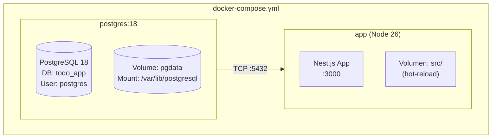
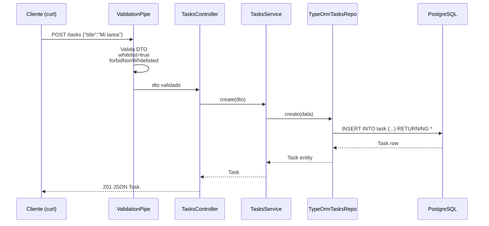
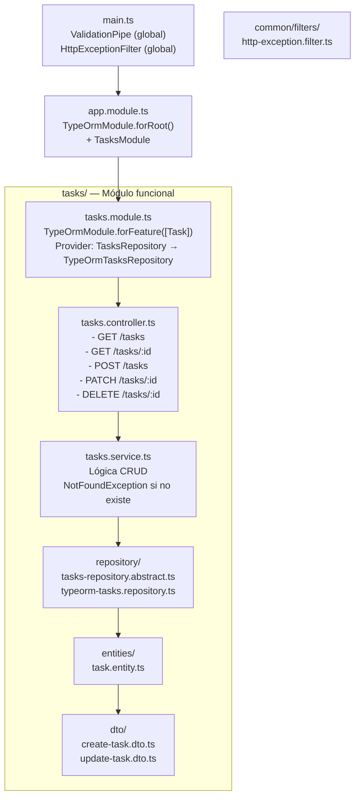
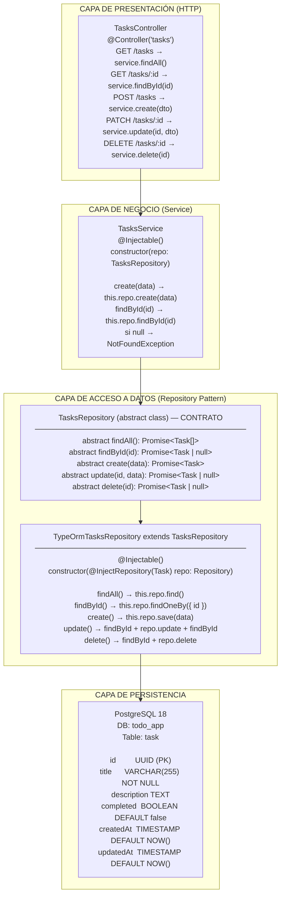
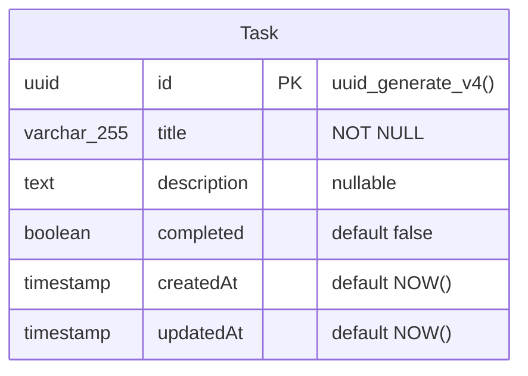

# Arquitectura del Backend — Todo App

## Stack Tecnológico

| Componente | Tecnología | Versión |
|---|---|---|
| Runtime | Node.js | 26 (Current) |
| Framework | Nest.js | 11.1 |
| Lenguaje | TypeScript | 5.x |
| ORM | TypeORM | 0.3.x |
| Base de datos | PostgreSQL | 18 |
| Contenedores | Docker + Compose | latest |
| Gestor paquetes | pnpm | 11.10 (corepack) |

## Arquitectura del Sistema



## Flujo de una Request (POST /tasks)



## Capas de la Aplicación



## Diagrama de Capas y Dependencias



## Diagrama de Base de Datos



### SQL DDL

```sql
CREATE TABLE "task" (
    "id"          UUID DEFAULT uuid_generate_v4() NOT NULL,
    "title"       VARCHAR(255) NOT NULL,
    "description" TEXT NULL,
    "completed"   BOOLEAN DEFAULT false NOT NULL,
    "createdAt"   TIMESTAMP DEFAULT NOW() NOT NULL,
    "updatedAt"   TIMESTAMP DEFAULT NOW() NOT NULL,
    CONSTRAINT "PK_task_id" PRIMARY KEY ("id")
);
```

### Nota sobre `synchronize: true`

TypeORM genera automáticamente el DDL anterior usando `synchronize: true`. Esto es aceptable solo en desarrollo. Para producción:

1. Deshabilitar `synchronize`: `synchronize: false`
2. Generar migración: `npx typeorm migration:generate`
3. Ejecutar migración: `npx typeorm migration:run`

## Diccionario de Datos

### Task

| Campo | Tipo | Nullable | Default | Descripción |
|---|---|---|---|---|
| `id` | UUID (PK) | No | `uuid_generate_v4()` | Identificador único generado automáticamente |
| `title` | VARCHAR(255) | No | - | Título de la tarea. Validado como string no vacío |
| `description` | TEXT | Sí | `NULL` | Descripción opcional de la tarea |
| `completed` | BOOLEAN | No | `false` | Estado de completitud |
| `createdAt` | TIMESTAMP | No | `NOW()` | Fecha/hora de creación (autogenerado) |
| `updatedAt` | TIMESTAMP | No | `NOW()` | Fecha/hora de última modificación (autogenerado) |

## API Reference

### Endpoints

| Método | Ruta | Body | Respuesta exitosa | Códigos error |
|---|---|---|---|---|
| `GET` | `/tasks` | - | `200` — `Task[]` | - |
| `GET` | `/tasks/:id` | - | `200` — `Task` | `404` — no encontrado |
| `POST` | `/tasks` | `CreateTaskDto` | `201` — `Task` | `400` — validación |
| `PATCH` | `/tasks/:id` | `UpdateTaskDto` | `200` — `Task` | `400`, `404` |
| `DELETE` | `/tasks/:id` | - | `200` — `void` | `404` |

### DTOs

**CreateTaskDto**
```typescript
class CreateTaskDto {
  @IsString()
  @IsNotEmpty()
  title: string;

  @IsString()
  @IsOptional()
  description?: string;
}
```

**UpdateTaskDto**
```typescript
class UpdateTaskDto extends PartialType(CreateTaskDto) {
  @IsBoolean()
  @IsOptional()
  completed?: boolean;
}
```

### Respuesta de Error

```json
{
  "statusCode": 404,
  "message": "Task with id 550e8400-e29b-41d4-a716-446655440000 not found",
  "timestamp": "2026-07-09T02:55:38.237Z"
}
```

```json
{
  "statusCode": 400,
  "message": ["title should not be empty", "title must be a string"],
  "timestamp": "2026-07-09T02:55:38.237Z"
}
```

### Ejemplos curl

```bash
# Crear tarea
curl -s -X POST http://localhost:3000/tasks \
  -H "Content-Type: application/json" \
  -d '{"title":"Comprar pan","description":"Pan integral"}'

# Listar tareas
curl -s http://localhost:3000/tasks

# Obtener una tarea
curl -s http://localhost:3000/tasks/<uuid>

# Actualizar tarea
curl -s -X PATCH http://localhost:3000/tasks/<uuid> \
  -H "Content-Type: application/json" \
  -d '{"completed":true}'

# Eliminar tarea
curl -s -X DELETE http://localhost:3000/tasks/<uuid>
```

## Estructura del Monorepo

```
todo-app/
├── package.json                    ← private: true, scripts con --filter
├── pnpm-workspace.yaml            ← packages: ['apps/*', 'packages/*']
├── docker-compose.yml             ← Orquesta postgres + app
│
├── apps/
│   └── backend/                   ← Nest.js API
│       ├── package.json
│       ├── Dockerfile
│       ├── tsconfig.json          ← paths: @/* → src/*
│       ├── nest-cli.json
│       └── src/
│           ├── main.ts
│           ├── app.module.ts
│           ├── tasks/             ← Módulo Tasks
│           └── common/            ← Filtros globales
│
├── packages/                      ← (futuro) librerías compartidas
│
├── openspec/                      ← Configuración de desarrollo
│   ├── config.yaml                ← Contexto y reglas del proyecto
│   └── changes/                   ← Cambios planificados
│       └── todo-app-backend/
│
└── docs/
    └── architecture.md            ← Este documento
```

## Reglas y Convenciones

### TypeScript

- **Imports absolutos**: Usar siempre `@/` en lugar de rutas relativas
- **Tipado estricto**: `strictNullChecks`, `noImplicitAny`, `strictBindCallApply`
- **DTOs**: `class-validator` decorators en propiedades, `PartialType` para updates
- **Entity**: Columnas decoradas con tipo explícito y defaults

### Nest.js

- **Módulo por feature**: Cada funcionalidad es un módulo autocontenido
- **Repository Pattern**: Clase abstracta como token DI (no interface)
- **Servicio**: Lógica de negocio + NotFoundException
- **Controlador**: Solo maneja HTTP, delega al servicio
- **Validación**: Global con whitelist + forbidNonWhitelisted
- **Errores**: Filtro global que normaliza responses

### Docker

- **Dockerfile por app**: Cada app define su propia imagen desde la raíz del monorepo
- **Postgres 18+**: Volume mount en `/var/lib/postgresql` (no `/var/lib/postgresql/data`)
- **Node 26**: Corepack no viene preinstalado → `npm install -g corepack`
- **Hot-reload**: Volumen bind-mount `./apps/backend/src:/app/apps/backend/src`
- **Healthcheck**: Postgres con `pg_isready`, app depende de `service_healthy`
